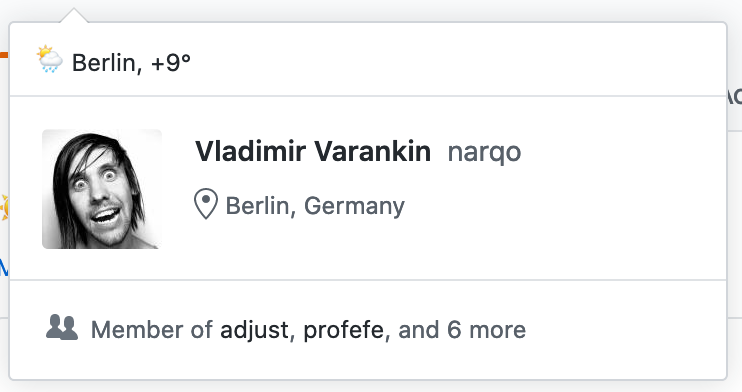

# :partly_sunny: Weather Status Widget for GitHub



A silly program to update your GitHub user's [profile status](https://github.blog/changelog/2019-01-09-set-your-status/) with the current weather:


The program retrieves data from [OpenWeather API](https://openweathermap.org). It requires API key,
that can be obtained for free, following [OpenWeather API documentation][1].

To update user's status on GitHub, the program uses [GitHub's GraphQL API](https://developer.github.com/v4/) and requires API
token with `user` scope.

## Usage

```
$ go build -o github-weather ./
$ github-weather -github.token <gh-api-token> -owm.api-key <open-weather-api-token> -owm.query <City>
```

`github-weather -help` will print the list of all available options.

### Run the program as cronjob

```
*/10 * * * * github-weather [params] 2>> github-weather.log
```

See example of a crontab file in the project's `misc` directory.

[1]: https://openweathermap.org/api
